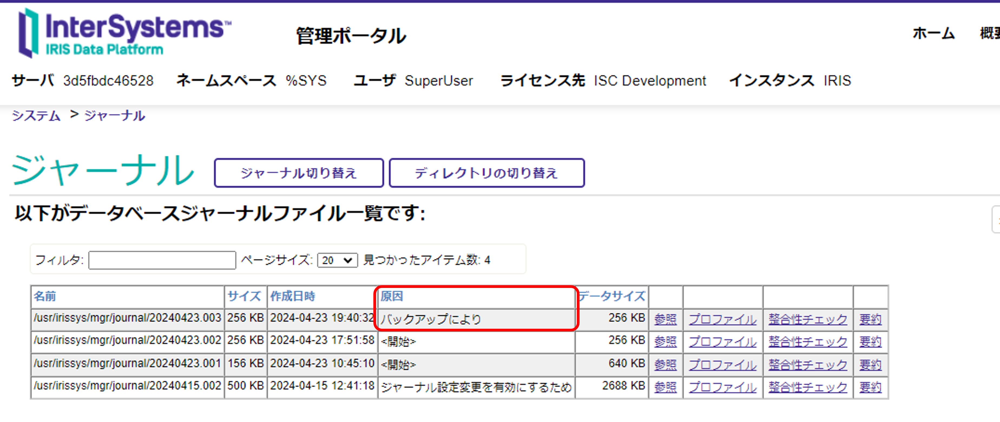

# (2)外部バックアップのバックアップとリストア：InterSystems製品のデータベースバックアップ種類別のリストア方法について

外部バックアップとは、InterSystems製品の専用ルーチン使用せず、InterSystems製品以外のバックアップソリューションを使用して、データベースをバックアップする方法で、現時点の**推奨されるバックアップ方法**です。

> 詳細な説明、手順については、ドキュメント「[外部バックアップ](https://docs.intersystems.com/irisforhealthlatestj/csp/docbook/DocBook.UI.Page.cls?KEY=GCDI_backup#GCDI_backup_methods_ext)」をご参照ください。

外部バックアップでは、主に、論理ディスク・ボリュームの有効な **"スナップショット"** を迅速に作成するテクノロジと共に使用します。

例えば、
- Windowsサーバの場合は、VSS（ボリューム・シャドウ・コピー・サービス）と組み合わせて利用する
- [AWSのEBS Snapshot](https://docs.aws.amazon.com/ja_jp/ebs/latest/userguide/ebs-snapshots.html)と組み合わせて利用する

スナップショット・テクノロジが使用できないシステムであっても、後述する「[特別な考慮](#特別な考慮)」で対応できればご利用いただけます。

この記事では、外部バックアップの前後で必要となるIRIS側の手続きについて解説します。

- [外部バックアップ前後で必要となる処理](#1外部バックアップ前後で必要となる処理ライトデーモンの一時停止と再開)
- [外部バックアップ手順](#外部バックアップ手順)
- [特別な考慮](#特別な考慮)
    - [第7引数ExternalFreezeTimeOut](#第7引数externalfreezetimeout)
    - [第10引数WDSuspendLimit](#第10引数wdsuspendlimit)
    - [目的別留意点](#目的別留意点)
        - [A. バックアップを確実に成功させたい場合](#a-バックアップを確実に成功させたい場合)
        - [B. バックアップ中にユーザプロセスの一時停止を避けたい場合](#b-バックアップ中にユーザプロセスの一時停止を避けたい場合)
- [バックアップからのリストア方法](#バックアップからのリストア方法)
    - [バックアップ時点に退避したWIJを利用したリストアの手順](#バックアップ時点に退避したwijを利用したリストアの手順)
    - [バックアップ時点のWIJを使用しないでリストアを行う手順](#バックアップ時点のwijを使用しないでリストアを行う手順)
- [演習：外部バックアップとリストア](#演習外部バックアップとリストア)

- [ご参考](#ご参考)

    サンプルスクリプトが公開されている記事などをご紹介しています。  

## 外部バックアップ前後で必要となる処理（ライトデーモンの一時停止と再開）

最初に、外部バックアップを実行するために、データベースに未反映の更新ブロックをデータベースに書き込む必要があります。

InterSystems製品では、ライトデーモン（WRTDMN）というシステムプロセスが、データベースに加わった変更をデータベースに書き込む一連の流れを管理しています。

ライトデーモンの働きについて詳しくは、ウェビナー：[IRISデータベースの内部動作](https://www.youtube.com/watch?list=PLzSN_5VbNaxB39_H2QMMEG_EsNEFc0ASz&v=VeSmItD_jHw&feature=youtu.be)をご参照ください。

通常時ライトデーモンは、以下の順序でデータベースに更新データを反映します。

① データベースキャッシュにたまった更新ブロックをライトイメージジャーナルファイル(WIJ)に退避し、WIJへ正常に退避できたブロックに**リカバリ判定フラグ**をセットします。


更新ブロックのWIJへの退避が完了すると

② データベースファイルに更新ブロックを反映し、反映が正常に終了するとWIJにつけたリカバリ判定フラグをリセットします。


ライトデーモンは一定間隔（*）で①～②の処理を繰り返し実行します。

> (*) この間隔はシステムにより短い頻度に変更される場合もあります。

外部バックアップを実行する場合、データベースへ書き込みを命令するライトデーモンの動作を止めない限り、正常なデータベースの退避が行えません。

タイミングが悪いと、②でIRIS.DATに反映させているブロックが一部のみの状態のデータベースファイルを退避してしまう可能性があり、このデータベースファイルを利用してリストアを行うことでデータベース壊す可能性があります。

この理由から、外部バックアップを実行する前にライトデーモンの処理を一時的に凍結させた状態でスナップショットを取り、スナップショットの取得が終了したらライトデーモンを凍結解除する手続きを行う必要があります。

外部バックアップ前後で利用するメソッドは以下の通りです。

- ライトデーモンの一時凍結（[BackUp.General](https://docs.intersystems.com/irisforhealthlatest/csp/documatic/%25CSP.Documatic.cls?LIBRARY=%25SYS&CLASSNAME=Backup.General)クラスの[ExternalFreeze()](https://docs.intersystems.com/irisforhealthlatest/csp/documatic/%25CSP.Documatic.cls?LIBRARY=%25SYS&CLASSNAME=Backup.General#ExternalFreeze)）

- ライトデーモンの再開（[BackUp.General](https://docs.intersystems.com/irisforhealthlatest/csp/documatic/%25CSP.Documatic.cls?LIBRARY=%25SYS&CLASSNAME=Backup.General)クラスの[ExternalThaw()](https://docs.intersystems.com/irisforhealthlatest/csp/documatic/%25CSP.Documatic.cls?LIBRARY=%25SYS&CLASSNAME=Backup.General#ExternalThaw)）


## 外部バックアップ手順

バックアップ手順は以下の通りです。

1) ライトデーモンの一時凍結（[BackUp.General](https://docs.intersystems.com/irisforhealthlatest/csp/documatic/%25CSP.Documatic.cls?LIBRARY=%25SYS&CLASSNAME=Backup.General)クラスの[ExternalFreeze()](https://docs.intersystems.com/irisforhealthlatest/csp/documatic/%25CSP.Documatic.cls?LIBRARY=%25SYS&CLASSNAME=Backup.General#ExternalFreeze)）

    具体的なコマンドは以下の通りです。

    InterSystems製品にログインし、%SYSネームスペースに移動します。

    > Linuxやコンテナ利用時は、iris session インスタンス名 -U %SYS／ ccontrol session インスタンス名 -U %SYS でログインできます。

    ```
    set status=##class(Backup.General).ExternalFreeze()
    write status
    ```

    必ずExternalFreeze()の実行結果を確認してください。ライトデーモン（WRTDMN）の凍結が成功するとステータスOKとして1が返ります（$$$OK）。

    > このコマンドがO/Sスクリプトの一部として使用された場合、システムの凍結に成功すると、Status値として5が返されます。凍結に失敗した場合は、Status値として3が返されます。実行例文は[BackUp.General](https://docs.intersystems.com/irisforhealthlatest/csp/documatic/%25CSP.Documatic.cls?LIBRARY=%25SYS&CLASSNAME=Backup.General)クラスの[ExternalFreeze()](https://docs.intersystems.com/irisforhealthlatest/csp/documatic/%25CSP.Documatic.cls?LIBRARY=%25SYS&CLASSNAME=Backup.General#ExternalFreeze)をご参照ください。

    またジャーナルファイルが切り替わります。

    リストア作業を行う場合、ExternalFreeze()の実行により切り替わったジャーナルファイルからリストアを開始するため、ファイル名を記録しておきます。

    ファイル名は、**管理ポータル > [システムぺレーション] > [ジャーナル]** より確認できます。「原因」列に「バックアップにより」と記載されている行のファイル名がバックアップにより切り替わったファイルです。

    

    エラーの場合は、エラーステータスが戻るためエラー情報を確認するため、以下メソッドを実行してください。

    ```
    write $system.Status.GetErrorText(status)
    ```
    エラーステータスの取得方法について詳しくは、[ObjectScriptクックブック](https://github.com/Intersystems-jp/ObjectScriptCookBook/blob/master/CookBook.md)の[%Statusのエラーが返ってきたら](https://github.com/Intersystems-jp/ObjectScriptCookBook/blob/master/CookBook.md#status%E3%81%AE%E3%82%A8%E3%83%A9%E3%83%BC%E3%81%8C%E6%88%BB%E3%81%A3%E3%81%A6%E3%81%8D%E3%81%9F%E3%82%89)をご参照ください。

    **＊＊注意！＊＊**
   
    ExternalFreeze()でライトデーモン（WRTDMN）を凍結できる時間は10分（600秒）に設定されています。タイムアウト以内にExternalThaw()を実行しないとシステムの更新処理が一時停止状態になり、システムがハングアップした状態になります。ご注意ください。
    
    なお、タイムアウト値を延長する方法については後述の「[特別な考慮](#特別な考慮)」をご覧ください。

2) 外部のスナップショット・ユーティリティを使用して、ファイル・システムのスナップショットを作成します。

    リストアの目的別で退避内容が異なります。

    -   システム全体をリストアすることが目的の場合
    
        以下をバックアップ対象として退避します。

        - データベースディレクトリ
        - インストールディレクリ
        - WIJディレクトリ
        - ジャーナルディレクトリ
        - 構成ファイル(cpf)

        ※ ジャーナルファイルについては、バックアップ時点のファイルだけでなく、バックアップ以降のファイルがリストアで必要となるため、バックアップ以降のファイルも何らかの方法で退避する必要があります。

    - データベースのみのバックアップ

        対象となるデータベースディレクトリ以下を退避します。

    

3) 2.が終了したら、ライトデーモンを再開（[BackUp.General](https://docs.intersystems.com/irisforhealthlatest/csp/documatic/%25CSP.Documatic.cls?LIBRARY=%25SYS&CLASSNAME=Backup.General)クラスの[ExternalThaw()](https://docs.intersystems.com/irisforhealthlatest/csp/documatic/%25CSP.Documatic.cls?LIBRARY=%25SYS&CLASSNAME=Backup.General#ExternalThaw)）させます。

    1.と同様に、InterSystems製品にログインし、%SYSネームスペースに移動し、以下実行します。

    ```
    set status=##class(Backup.General).ExternalThaw()
    write status
    ```
    必ずExternalThaw()の実行結果もご確認ください。ライトデーモン（WRTDMN）の再開が成功するとステータスOKとして1が返ります（$$$OK）。

    エラーの場合は、エラーステータスが戻るためエラー情報を確認するため、以下メソッドを実行してください。

    ```
    write $system.Status.GetErrorText(status)
    ```

## 特別な考慮

スナップショット・テクノロジが利用できない環境であっても、[BackUp.General](https://docs.intersystems.com/irisforhealthlatest/csp/documatic/%25CSP.Documatic.cls?LIBRARY=%25SYS&CLASSNAME=Backup.General)クラスの[ExternalFreeze()](https://docs.intersystems.com/irisforhealthlatest/csp/documatic/%25CSP.Documatic.cls?LIBRARY=%25SYS&CLASSNAME=Backup.General#ExternalFreeze)の引数を利用することで実行することができます。

最初に注目すべき引数について説明します。

なお、引数を指定しない場合はデフォルト設定値で動作します。

### 第7引数：ExternalFreezeTimeOut

ExternalFreeze()でライトデーモンを休止する秒数を指定できます。（デフォルトは600秒（10分）に設定されています。

タイムアウトを迎えた場合、システムの更新処理が一時停止状態になり、システムがハングアップした状態になります。
ExternalThaw()を実行するまで、新規プロセスでInterSystems製品へログインすることができません。

※ ExternalFreeze()前から稼働中のプロセスは継続利用できますが、書き込みできなくなります。


### 第10引数：WDSuspendLimit

ライトデーモンを再開する時間を秒数で指定できます。
デフォルトは設定されていないため、ExternalThaw()の実行まで再開しません。

### 目的別留意点

第7、10引数に利用については、目的別の留意点があります。

#### A. バックアップを確実に成功させたい場合

**第7引数：ExternalFreezeTimeOut を バックアップ時間より長めに設定** します。ただし、指定可能な値の上限は1200秒です(それ以上長い値を指定しても1200秒が使用されます)。

留意点としては、バックアップ中のユーザプロセスからの更新で、データベースキャッシュが満杯になると、書き込みを行おうとするユーザプロセスは一時停止します。

#### B. バックアップ中にユーザプロセスの一時停止を避けたい場合

**第10引数：WDSuspendLimit を使用して、ライトデーモン再開までの秒数を指定します**（デフォルトは設定されていないため、ExternalThaw()の実行までライトデーモンは再開しません）。

留意点としては、バックアップ途中でライトデーモンが再開した場合、バックアップは失敗します。バックアップが失敗したかどうかを確認するには、ExternalThaw()の実行前に IsWDSuspended()メソッド の戻り値を利用して、ライトデーモンが休止中かどうかを確認します。

1が戻ると休止中、0が戻ると動作中を表します。

### その他の引数

#### 第1引数：LogFile

ログファイル名をフルパスで指定できます。指定したファイル名が存在しない場合は作成し、存在する場合はログはファイルの末尾から追加されます。デフォルトでは、すべてのメッセージをmessages.log（またはcconsole.log）に記録します。

#### 第2引数：Text

ジャーナル・マーカーに格納するオプションのテキスト文字列を指定できます。

#### 第3引数：SwitchJournalFile

0/1 で、システムをフリーズする前に新しいジャーナル・ファイルに切り替え、ジャーナル・マーカを追加するかどうかを指定します。デフォルトは1（ジャーナルを切り替えます）。

#### 第4引数：TimeOut 

（クラスタ化されていないシステムでは無視される引数）クラスタ化されたシステムの場合、システムが静止するまでの待ち時間 (秒)を指定できます。デフォルト10秒。

#### 第5引数：Hibernate 
（クラスタ化されていないシステムでは無視される引数）クラスタ化されたシステムの場合、失敗を返す前に（データベースの更新を再開して）ハイバネートし、ブロックと待機の全プロセスを再試行する回数を指定できます。デフォルトは0。

#### 第6引数：Verbose
（クラスタ化されていないシステムでは無視される引数）0/1 クラスタ化されたシステムの場合、何が起こっているかについてのメッセージを画面に出力するかどうか指定できます。デフォルトは0。

#### 第8引数：Username
ExternalThaw() メソッドに渡すユーザ名を指定できます。デフォルトは "" です。

#### 第9引数：Password

ExternalThaw() メソッドに渡すパスワードを指定できます。デフォルトは""です。
#### 第11引数：RequiredFile 

参照渡しで指定します。バックアップがリストアされた後、トランザクションのロールバックに必要な最も古いジャーナル・ファイル名が設定されます。


## バックアップからのリストア方法

リストアの目的に合わせ、バックアップファイルを使用してリストアします。

システム全体のリストアを目的としている場合、バックアップ時点に退避したWIJを利用するか／しないか、で方法が異なります。

データベースのみのリストア方法については **「[データベースのみのリストア方法](#データベースのみのリストア方法)」** をご参照ください。

外部バックアップ実行時（＝ExternalFreeze()）WIJには、データベースの更新ブロックの情報以外にジャーナルファイルへのポインタ情報が含まれています。

- トランザクションを開始している場合はトランザクションのオープン位置
- データベースに正常に書き込まれたデータに対するジャーナルエントリへのポインタ

上記ポインタ情報を利用したリストア方法については **「[システム全体のリストア：バックアップ時点に退避したWIJを利用したリストアの手順](#システム全体のリストアバックアップ時点に退避したwijを利用したリストアの手順)」** をご参照ください。

ポインタを利用せずにリストアを行う方法については **「[システム全体のリストア：バックアップ時点のWIJを使用しないでリストアを行う手順](#システム全体のリストアバックアップ時点のwijを使用しないでリストアを行う手順)」** をご参照ください。

### システム全体のリストア：バックアップ時点に退避したWIJを利用したリストアの手順

このリストアのシナリオでは、外部バックアップ時にデータベースファイル（IRIS.DATまたはCACHE.DAT）とともにWIJをバックアップする必要があります。

1. InterSystems製品がダウンした状態のままとします。

2. データベースファイル（IRIS.DATまたはCACHE.DAT）とバックアップ時に退避したWIJをリストアします。

    ダウンしたInterSystems製品の構成通りに配置します。
    
3. InterSystems製品を開始します。

    開始時、WIJの情報を元に、その時利用していたジャーナルファイルを利用して、**自動的にロールフォーワードを行います。**

4. 妥当性の検証やメンテナンスを行う目的で、ジャーナルファイルをリストアします（オプション）。

    ジャーナルリストアの流れは、[オンラインバックアップとリストア：10、ジャーナルリストアを実行](/OnlineBackup.md/#10ジャーナルリストアを実行)をご参照ください。

    >※上記例の中ではジャーナルに記録されている情報の中から、特定のデータベースディレクトリに対する記録のみをリストアする方法を解説しています。データベースディレクトリを目的のディレクトリに読み替えてご利用ください。
    
5. InterSystems製品を停止します。

6. InterSystems製品を通常開始します。ユーザからの接続が許可されます。


### システム全体のリストア：バックアップ時点のWIJを使用しないでリストアを行う手順

このリストアのシナリオでは、バックアップ時に退避しているWIJファイルを使用せずにリストアする方法を説明します（＝バックアップ時点のWIJがない場合でもリストアできる方法）。

1. InterSystems製品がダウンした状態のままとします。

2. データベースファイル（IRIS.DATまたはCACHE.DAT）をリストアします。

    ダウンしたInterSystems製品の構成通りに配置します。
    
3. InterSystems製品を開始します。

4. ダウンしたときのWIJを使用せず、開始します。

5. ジャーナルファイルをリストアします。

    ジャーナルリストアの流れは、[オンラインバックアップとリストア：10、ジャーナルリストアを実行](/OnlineBackup.md/#10ジャーナルリストアを実行)をご参照ください。

    >※上記例のジャーナルリストアではジャーナルに記録されている情報の中から、特定のデータベースディレクトリに対する記録のみをリストアする方法を解説しています。データベースディレクトリを目的のディレクトリに読み替えてご利用ください。

6. InterSystems製品を停止します。

7. InterSystems製品を通常開始します。ユーザからの接続が許可されます


### データベースのみのリストア方法

他の正常なデータベースを通常状態に戻すため、以下の手順でリストアします。

1. **障害発生時のWIJを用いてリストアを行うため** InterSystems製品を開始します。

    WIJをロールフォーワードし、さらに障害発生直前まで使用していたジャーナルファイルを使用して、リストア対象ではない他の正常なデータベースを直近の状態までロールフォーワードします。

2. InterSystems製品を一旦停止します。

    バックアップしていたデータベースファイル（IRIS.DATまたはCACHE.DAT）を利用して、データベースファイルを置き換えます。

3. InterSystems製品を開始します。

4. ジャーナルファイルをリストアします。

    リストアを開始するため、的確なジャーナルファイルを決定します。通常、バックアップ前に切り替えられたジャーナルファイルを利用して、リストアを開始します。

    ジャーナルリストアの流れは、[オンラインバックアップとリストア：10、ジャーナルリストアを実行](/OnlineBackup.md/#10ジャーナルリストアを実行)をご参照ください。

    >※上記例のジャーナルリストアでは、ジャーナルに記録されている情報の中から、特定のデータベースディレクトリに対する記録のみをリストアする方法を解説しています。データベースディレクトリを目的のディレクトリに読み替えてご利用ください。

※ 手順1で障害発生時点のWIJを使用したロールフォーワードリカバリが正常に終了しない場合もあります。その場合はサポートセンターまでお問い合わせください。

## 演習：外部バックアップとリストア

この演習では、単一のデータベースのバックアップを例に、外部バックアップ、バックアップファイルのリストア、ジャーナルリストアについて練習します。

演習では、以下データベースを外部バックアップで退避します。

- T1データベース＝/usr/irissys/mgr/t1

以下例では、T1データベースのあるディスクが壊れたことを想定し、リストア時のT1データベースディレクトリがバックアップ時点とは異なるディレクトリにリストアしなくてはならない場合の流れで解説します。

なお、バックアップファイルのリストア後、ジャーナルファイルを利用したリストアも行う必要がありますので以下の流れで試していきます。


- [1、バックアップ前にT1データベースに任意データ登録する（^prebackup=1）](#1バックアップ前にt1データベースに任意データ登録するprebackup1)
- [2、外部バックアップを実行する](#2外部バックアップを実行する)
- [3、切り替わったジャーナルファイル名を確認する](#3切り替わったジャーナルファイル名を確認する)
- [4、バックアップ後だとわかる任意データをT1データベースに登録する（^postbackup=1）](4、バックアップ後だとわかる任意データをT1データベースに登録する（^postbackup=1）)

- [5、ジャーナルファイルに 4で登録した情報が含まれているか確認する](#5ジャーナルファイルに-4で登録した情報が含まれているか確認する)
- [6、T1データベース（/usr/irissys/mgr/t1）を削除](#6t1データベースusririssysmgrt1を削除)


- [7、T1データベースを別ディレクトリ（/usr/irissys/mgr/t1rest）に再作成](#7t1データベースを別ディレクトリusririssysmgrt1restに再作成)
- [8、バックアップからのリストアを実行する](#8バックアップからのリストアを実行する)

    退避していたT1データベースのIRIS.datをリストア対象ディレクトリに置換します。

    - リストア対象ディレクトリ：/usr/irissys/mgr/t1rest

- [9、^prebackup=1 が戻ることを確認する](#9prebackup1-が戻ることを確認する)
- [10、ジャーナルリストアを実行](#10ジャーナルリストアを実行)

    T1データベースのみリストアするように指定します。
    - バックアップ時点のディレクトリ：/usr/irissys/mgr/t1
    - リストア時に指定するディレクトリ：/usr/irissys/mgr/t1rest
- [11、^postbackup=1 が戻ることを確認する](#11postbackup1-が戻ることを確認する)

---

### 1、バックアップ前にT1データベースに任意データ登録する（^prebackup=1）

ネームスペースT1に接続し、以下実行します。

Linuxやコンテナを利用されている場合は、`iris session インスタンス名 -U T1`でログインすると簡単です。

```
set $namespace="T1"
set ^prebackup=1
```
管理ポータルでデータを確認します。

**[システムエクスプローラ] > [グローバル] > T1ネームスペース選択**


グローバル変数名が多く一覧される場合、画面左端の「フィルタ」の「グローバル名」に`pre*` と書くとフィルタされた結果が表示されます。

### 2、外部バックアップを実行する

ライトデーモンを凍結させるため、以下実行します。

なお、ExternalFreeze()実行から10分後にタイムアウトを迎えます。**タイムアウト前にExternalThaw()を必ず実行し、ライトデーモンの凍結解除を行ってください。**

```
set status=##class(Backup.General).ExternalFreeze()
write status
```

変数statusに1が設定されていれば実行が成功したことを示します。

T1データベースディレクトリ（/usr/irissys/mgr/t1）を退避エリアにコピーします。

コピーが完了したら、凍結解除用メソッドを実行します。

```
set status=##class(Backup.General).ExternalThaw()
write status
```

### 3、切り替わったジャーナルファイル名を確認する

**管理ポータル > [システムオペレーション] > [ジャーナル]** 「バックアップにより」切り替わったジャーナルファイルを確認します。

以下の例でジャーナルリストアの開始ファイルとして指定するファイル名は「/usr/irissys/mgr/journal/20240426.002」です。

### 4、バックアップ後だとわかる任意データをT1データベースに登録する（^postbackup=1）

ネームスペースT1に接続し、以下実行します。

Linuxやコンテナを利用されている場合は、`iris session インスタンス名 -U T1`でログインすると簡単です。

```
set $namespace="T1"
set ^postbackup=1
```

### 5、ジャーナルファイルに 4で登録した情報が含まれているか確認する

**管理ポータル > [システムオペレーション] > [ジャーナル]** で現在のジャーナルファイルを開き、^postbackupが記録されているか確認します。


画面右端のデータベースディレクトリ名を確認し、「/usr/irissys/mgr/t1」で記録されていることを確認します。

### 6、T1データベース（/usr/irissys/mgr/t1）を削除

管理ポータルメニューから削除します。

稼働中に削除する場合、一旦データベースをディスマウントすることをお勧めします。

**管理ポータル > [システムオペレーション] > [データベース] > T1を選択 > ディスマウントボタンをクリック**


ディスマウント後、構成メニューに移動しデータベースを削除します。

**管理ポータル > [システム管理] > [構成] > [システム構成] > [ローカルデータベース] > T1を削除**


この削除時に **”チェックしたネームスペースを削除します” の T1 にチェックを入れてT1ネームスペースも削除します。**


### 7、T1データベースを別ディレクトリ（/usr/irissys/mgr/t1rest）に再作成

管理ポータルでT1ネームスペース、データベースを作成します。

このときのデータベースは最初に作成したディレクトリとは異なるディレクトリで作成します。

例では、**/usr/irissys/mgr/t1rest** としています。


### 8、バックアップからのリストアを実行する

作成したT1データベース（**/usr/irissys/mgr/t1rest**）をディスマウントします。

**管理ポータル > [システムオペレーション] > [データベース] > T1を選択 > ディスマウントボタンをクリック**

ディスマウント中に、退避していたT1データベースのIRIS.dat（元/usr/irissys/mgr/t1以下にあったIRIS.dat）を　**/usr/irissys/mgr/t1rest**　に置換します。

置換後、マウントボタンでデータベースをマウントします。

### 9、^prebackup=1 が戻ることを確認する

**管理ポータル > [システムエクスプローラ] > [グローバル] > T1ネームスペース選択**

^prebackupは表示されますが、^postbackupがまだ戻っていないことを確認します。

### 10、ジャーナルリストアを実行

ジャーナルリストアの流れは、[オンラインバックアップとリストア：10、ジャーナルリストアを実行](/OnlineBackup.md/#10ジャーナルリストアを実行)をご参照ください。

### 11、^postbackup=1 が戻ることを確認する

**管理ポータル > [システムエクスプローラ] > [グローバル] > T1ネームスペース選択**

^postbackupが存在するか確認します。


## ご参考

- [Automating application-consistent Amazon EBS Snapshots for InterSystems IRIS databases](https://aws.amazon.com/jp/blogs/storage/automating-application-consistent-amazon-ebs-snapshots-for-intersystems-iris-databases/)

    このページでは、Amazon EBSスナップショット形式でEC2インスタンス上で実行されているIRISの外部バックアップを作成する方法と概要を解説しています。

- [Azure BackupによるInterSystems IRISおよびCachéアプリケーション・コンシステントなバックアップ](https://jp.community.intersystems.com/node/481771)

    InterSystems IRIS で実行する場合、本文中のprescript.sh、postScript.shの中に登場する`csession <CACHE INSTANCE>` は、`iris session <IRIS インスタンス名>`に変更してから実行してください。

- [InterSystems Data Platforms and performance – VM Backups and IRIS freeze/thaw scripts](https://community.intersystems.com/node/423776)

    ＜ご参考＞この記事の[日本語翻訳記事](https://jp.community.intersystems.com/node/479796)では、Caché用スクリプトが紹介されています。
